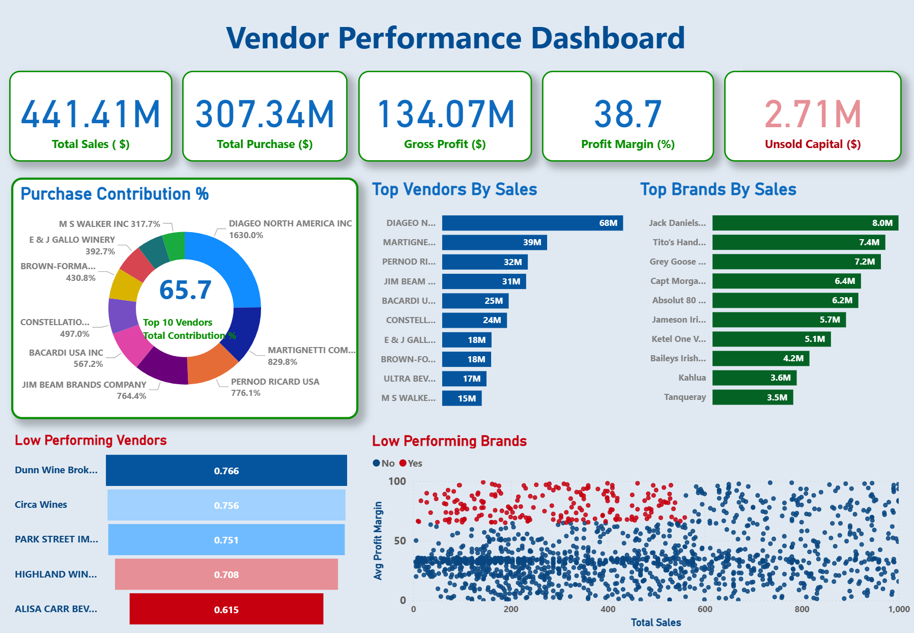

# 📊 Vendor Performance Analysis - Retail Inventory & Sales

_Analyzing vendor efficiency and profitability to support strategic purchasing and inventory decisions using SQL, Python, and Power BI._

---

## 📌 Table of Contents

- [Overview](#overview)
- [Business Problem](#business-problem)
- [Dataset](#dataset)
- [Tools & Technologies](#tools--technologies)
- [Project Structure](#project-structure)
- [Data Cleaning & Preparation](#data-cleaning--preparation)
- [Exploratory Data Analysis (EDA)](#exploratory-data-analysis-eda)
- [Research Questions & Key Findings](#research-questions--key-findings)
- [Dashboard](#dashboard)
- [How to Run This Project](#how-to-run-this-project)
- [Final Recommendations](#final-recommendations)
- [Author & Contact](#author--contact)

---

## Overview

This project evaluates vendor performance and retail inventory dynamics to drive strategic insights for purchasing, pricing, and inventory optimization.

A complete analytics pipeline was built using:

- SQL for data extraction and transformation
- Python for EDA and statistical analysis
- Power BI for interactive dashboards

---

## Business Problem

Effective inventory and sales management are critical in the retail sector. This project aims to:

- Identify underperforming brands needing pricing or promotional adjustments
- Determine vendor contributions to sales and profits
- Analyze the cost-benefit of bulk purchasing
- Investigate inventory turnover inefficiencies
- Statistically validate vendor profitability differences

---

## Dataset

The project uses retail inventory and sales data consisting of:

- Purchases
- Sales
- Purchase Prices
- Vendor Invoices

Data was loaded into SQLite and transformed into a vendor-level summary table.

---

## Tools & Technologies

- SQL (CTEs, Joins, Aggregations)
- Python (Pandas, NumPy, Matplotlib, Seaborn, SciPy)
- SQLite
- Power BI
- Git & GitHub

---

## Project Structure

```text
vendor-performance-analysis/
│
├── README.md
├── inventory.db
│
├── data/
│
├── notebooks/
│   └── Vendor_Performance_Analysis.ipynb
│
├── scripts/
│   ├── ingestion_db.py
│   └── get_vendor_summary.py
│
├── logs/
│   ├── ingestion_db.log
│   └── get_vendor_summary.log
│
├── dashboard/
│   └── Vendor_Performance_Dashboard.pbix
│
└── images/
    └── dashboard.png
```

---

## Data Cleaning & Preparation

The following preprocessing steps were performed:

- Handled missing values
- Converted data types
- Removed unwanted spaces
- Created vendor-level summary tables
- Calculated:

  - Gross Profit
  - Profit Margin
  - Stock Turnover
  - Sales to Purchase Ratio

---

## Exploratory Data Analysis (EDA)

### Summary Statistics Insights

#### Negative & Zero Values

- Gross Profit minimum value: **-52,002.78**
- Profit Margin contains negative values indicating loss-making transactions
- Some products were purchased but never sold

#### Outliers

- Freight Cost showed large variation across vendors
- Premium products had significantly higher purchase prices
- Inventory turnover contained extreme values

#### Correlation Analysis

- Strong positive correlation between Purchase Quantity and Sales Quantity
- Weak relationship between Purchase Price and Profit
- Negative relationship between Profit Margin and Sales Price

---

## Research Questions & Key Findings

### Brands Requiring Promotional Attention

Several brands showed:

- Low sales performance
- High profit margins

These products may benefit from targeted promotions and pricing strategies.

### Vendor Concentration Risk

A small number of vendors contribute a significant portion of purchases, creating dependency risk.

### Bulk Purchasing Impact

Higher purchase volumes generally reduce unit costs and improve purchasing efficiency.

### Inventory Turnover

Some products remained unsold despite high purchase quantities, indicating slow-moving inventory.

### Vendor Profitability

Profitability varies significantly across vendors, suggesting different pricing and purchasing strategies.

---

## Dashboard

Power BI Dashboard includes:

- Vendor-wise Sales Analysis
- Profitability Analysis
- Inventory Turnover Metrics
- Purchase vs Sales Comparison
- Vendor Performance KPIs



---

## How to Run This Project

### 1. Clone Repository

```bash
git clone https://github.com/yourusername/vendor-performance-analysis.git
```

### 2. Open Jupyter Notebook

```bash
jupyter notebook
```

### 3. Run Analysis Notebook

```text
notebooks/Vendor_Performance_Analysis.ipynb
```

### 4. Open Power BI Dashboard

```text
dashboard/Vendor_Performance_Dashboard.pbix
```

---

## Final Recommendations

- Reduce dependency on a small set of vendors
- Promote high-margin low-sales products
- Improve inventory turnover management
- Optimize purchasing strategies
- Monitor vendor profitability regularly

---

## Author & Contact

**Shweta Mehta**  
Aspiring Data Analyst

- LinkedIn:[Shweta Mehta](https://www.linkedin.com/in/shweta-mehta07/)
- GitHub:  [ShwetaMehta08](https://github.com/ShwetaMehta08)